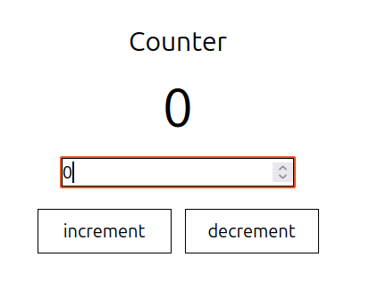

# Counter React App

A simple and interactive counter application built using **React.js**. This project helps to understand the basics of state management with React's `useState` hook.

## 🚀 Features

- ➕ Increment the counter with specified input 
- ➖ Decrement the counter with specified input
- 🔁 Reset the counter
- ⚛️ React state updates in real-time

## 📸 Screenshot



 

## 🛠️ Tech Stack

- React.js
- JavaScript (ES6+)
- HTML5 & CSS3


## 📦 Installation & Setup

1. Clone the repository:

```bash
git clone https://github.com/K-Ravindhar/counter-react.git
cd Counter
```
2. Install the dependency
```bash
npm install 
```
3. Run project
```bash
npm run dev
```

## Link
https://counter-react-one-sigma.vercel.app/


